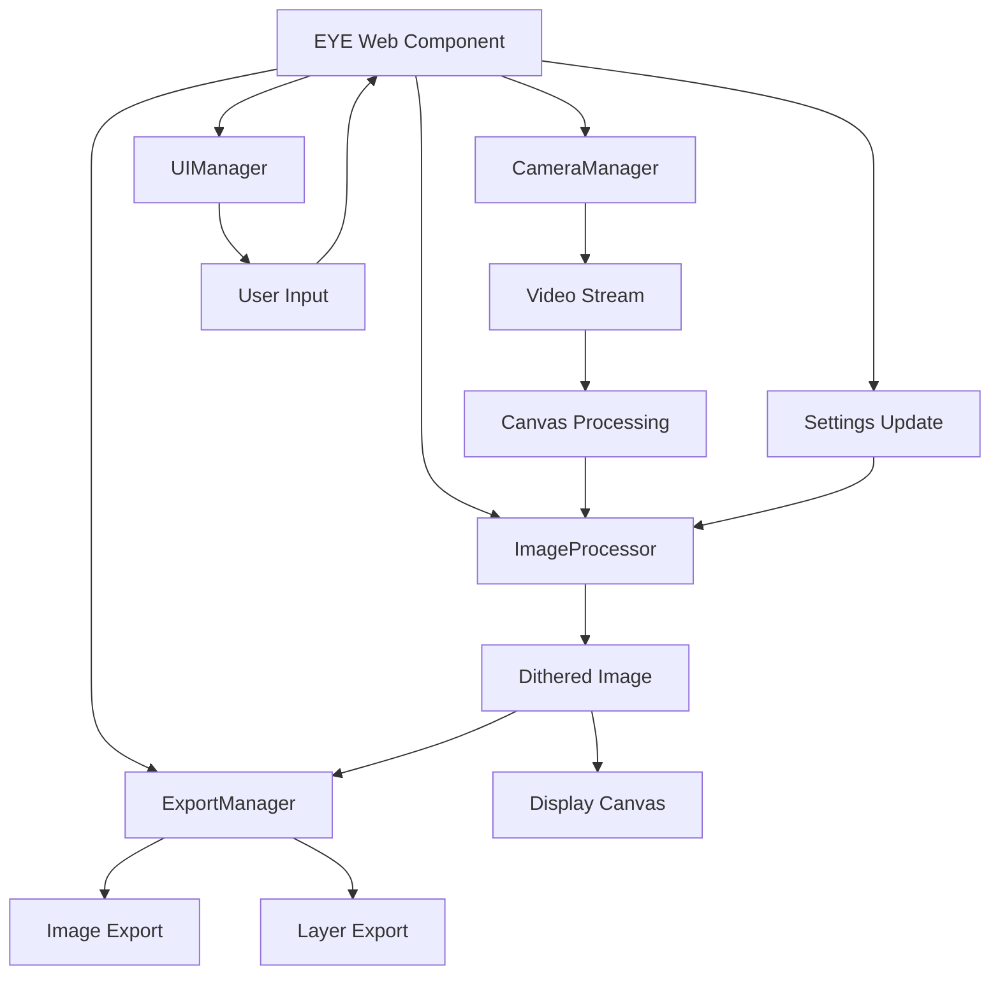

# EYE Web Component - Architecture Documentation

## Overview

The EYE web component has been rearchitected from a monolithic 1200+ line single file into a modular, maintainable system. This document outlines the new architecture, design patterns, and how the components work together.

## Architecture Principles

- **Separation of Concerns**: Each module handles a specific responsibility
- **Single Responsibility Principle**: Classes have one clear purpose
- **Dependency Injection**: Components receive their dependencies rather than creating them
- **Event-Driven Communication**: Loose coupling through events and callbacks
- **ES6 Modules**: Modern JavaScript module system for clean imports/exports

## File Structure

```
crash-camera/
├── index.js                          # Main entry point and EYE web component
├── index-original.js                 # Backup of original monolithic code
├── src/
│   ├── camera/
│   │   └── CameraManager.js          # Camera access and device management
│   ├── image/
│   │   └── ImageProcessor.js         # Image processing and dithering algorithms
│   ├── ui/
│   │   └── UIManager.js              # User interface creation and management
│   ├── export/
│   │   └── ExportManager.js          # Image capture and layer export
│   └── utils/
│       ├── Constants.js              # Configuration constants and defaults
│       └── ColorUtils.js             # Color conversion and palette utilities
├── webpack.config.js                 # Build configuration
├── package.json                      # Dependencies and scripts
└── test.html                         # Test page for the component
```

## Core Components

### 1. EYE Web Component (`index.js`)

**Responsibility**: Main orchestrator and web component lifecycle management

**Key Features**:
- Web component lifecycle methods (`connectedCallback`, `disconnectedCallback`, etc.)
- Attribute observation and change handling
- Manager coordination and initialization
- Canvas setup and video polling loop
- Event dispatching

**Dependencies**:
- CameraManager
- ImageProcessor  
- UIManager
- ExportManager
- Constants utilities

### 2. CameraManager (`src/camera/CameraManager.js`)

**Responsibility**: Camera access, device enumeration, and video stream management

**Key Features**:
- `getUserMedia` API integration
- Device enumeration with permission handling
- Mobile camera switching (front/back)
- Stream lifecycle management
- Constraint building for different device types

**Public API**:
```javascript
initialize(onStreamReady)
getAvailableDevices()
setSelectedDevice(deviceId)
startStream()
stopStream()
getVideoElement()
getVideoDimensions()
```

### 3. ImageProcessor (`src/image/ImageProcessor.js`)

**Responsibility**: Image processing, color quantization, and dithering algorithms

**Key Features**:
- Multiple dithering algorithms (Floyd-Steinberg, Atkinson, Burkes, etc.)
- Threshold dithering for retro aesthetics
- Error diffusion algorithms for smooth gradients
- Palette management for risograph printing
- Color space processing

**Public API**:
```javascript
setDitherMethod(method)
setPalette(color1, color2, color3, color4, color5)
applyDithering(imageData)
```

**Supported Algorithms**:
- Floyd-Steinberg (classic, balanced)
- Atkinson (high contrast, Mac-style)
- Burkes (wide error distribution)
- Sierra (complex pattern, detailed images)
- Stucki (high quality, more diffusion points)
- Jarvis-Judice-Ninke (highest quality, slowest)
- Threshold (simple, no error diffusion)

### 4. UIManager (`src/ui/UIManager.js`)

**Responsibility**: User interface creation, event handling, and state management

**Key Features**:
- Dynamic UI element creation
- Slider management for image adjustments
- Color picker interface
- Camera device dropdown
- Dithering method selector
- Export controls
- Callback-based event handling

**Public API**:
```javascript
initialize(parentElement, callbacks)
createMenu()
createImageSliders(defaultValues)
createBottomControls()
createColorPicker(colors)
updateCameraList(devices, selectedDeviceId)
resetSliders(defaultValues)
```

### 5. ExportManager (`src/export/ExportManager.js`)

**Responsibility**: Image capture, layer separation, and export functionality

**Key Features**:
- JPEG image capture from canvas
- Risograph layer separation (5 color channels)
- PNG export for print-ready files
- Data URL generation
- Event dispatching for captures
- Canvas drawing utilities

**Public API**:
```javascript
initialize(scratchCanvas, finalCanvas, eventTarget)
getJpeg()
getImageData()
takePicture()
exportRisographLayers(color1, color2, color3, color4, color5, eyeSize)
drawLine(startX, startY, endX, endY, lineWidth, strokeStyle)
```

### 6. Utility Modules

#### Constants (`src/utils/Constants.js`)
- Default configuration values
- CSS style definitions
- Event names
- Dithering algorithm definitions
- Observable attributes list

#### ColorUtils (`src/utils/ColorUtils.js`)
- Color space conversions (CSS to RGB, RGB to hex)
- Color distance calculations (Euclidean distance)
- Palette generation for risograph printing
- Closest color matching algorithms

## Data Flow



## Communication Patterns

### 1. Callback-Based Communication
UI events flow through callback functions passed to the UIManager:

```javascript
const callbacks = {
  onSliderChange: (type, value) => { this[type] = value; },
  onColorChange: (propertyName, newColor) => { 
    this[propertyName] = newColor;
    this.imageProcessor.setPalette(...colors);
  }
};
```

### 2. Event Dispatching
Component events are dispatched from the main EYE component:

```javascript
this.dispatchEvent(new CustomEvent('IMAGE DRAWN', {
  detail: processedImageData
}));
```

### 3. Direct Method Calls
Managers are called directly from the main component for actions:

```javascript
this.cameraManager.startStream();
this.imageProcessor.setDitherMethod(method);
this.exportManager.exportRisographLayers(...);
```

## Configuration and Customization

### HTML Attributes
All component properties can be set via HTML attributes:

```html
<e-y-e 
  contrast="120"
  saturation="110" 
  color-1="black"
  color-2="orange"
  dither-method="floyd-steinberg">
</e-y-e>
```

### JavaScript API
Properties can also be modified programmatically:

```javascript
const eyeComponent = document.querySelector('e-y-e');
eyeComponent.setAttribute('contrast', '150');
eyeComponent.setAttribute('dither-method', 'atkinson');
```

### CSS Customization
UI styles are defined in constants and can be customized:

```javascript
// In Constants.js
export const CSS_STYLES = {
  exportButton: `
    background: #ff6b35;
    color: white;
    // ... more styles
  `
};
```

## Build System

The component uses Webpack for bundling:

```javascript
// webpack.config.js
module.exports = {
  entry: ['./index.js', './index.css'],
  output: {
    filename: 'e-y-e.min.js'
  },
  experiments: {
    outputModule: true
  }
};
```

Build commands:
```bash
npm install      # Install dependencies
npm run build    # Build for production
npm start        # Start development server
```

## Testing

A comprehensive test page (`test.html`) provides:
- Component initialization testing
- Attribute change testing  
- Event monitoring
- Interactive controls for all features
- Performance monitoring

## Benefits of the New Architecture

### Maintainability
- **Smaller Files**: Each module is focused and manageable (200-400 lines vs 1200+)
- **Clear Responsibilities**: Easy to understand what each component does
- **Isolated Testing**: Each manager can be tested independently

### Extensibility
- **New Dithering Algorithms**: Add to ImageProcessor without touching other code
- **New UI Elements**: Extend UIManager with new controls
- **New Export Formats**: Add to ExportManager without affecting processing

### Reusability
- **Standalone Managers**: CameraManager could be used in other projects
- **Utility Functions**: ColorUtils can be imported anywhere
- **Component Patterns**: UI creation patterns can be replicated

### Performance
- **Lazy Loading**: Managers only initialize when needed
- **Memory Management**: Proper cleanup in disconnectedCallback
- **Efficient Processing**: Image processing isolated from UI updates

## Migration Notes

The rearchitected version maintains 100% API compatibility with the original:
- Same HTML attributes
- Same events dispatched
- Same public methods available
- Same visual appearance and behavior

Existing code using the component requires no changes.

## Future Improvements

Potential enhancements enabled by the new architecture:

1. **WebAssembly Integration**: Move dithering algorithms to WASM for performance
2. **Web Workers**: Process images in background threads
3. **Plugin System**: Allow third-party dithering algorithms
4. **Testing Framework**: Unit tests for each manager
5. **TypeScript**: Add type safety with minimal refactoring
6. **State Management**: Implement Redux-like state management
7. **WebGL Processing**: GPU-accelerated image processing

## Conclusion

The new modular architecture transforms the EYE web component from a monolithic, difficult-to-maintain codebase into a clean, extensible, and professional system. Each component has a clear purpose, dependencies are explicit, and the code follows modern JavaScript best practices.

This architecture enables easier debugging, testing, and feature development while maintaining full backward compatibility with existing usage.